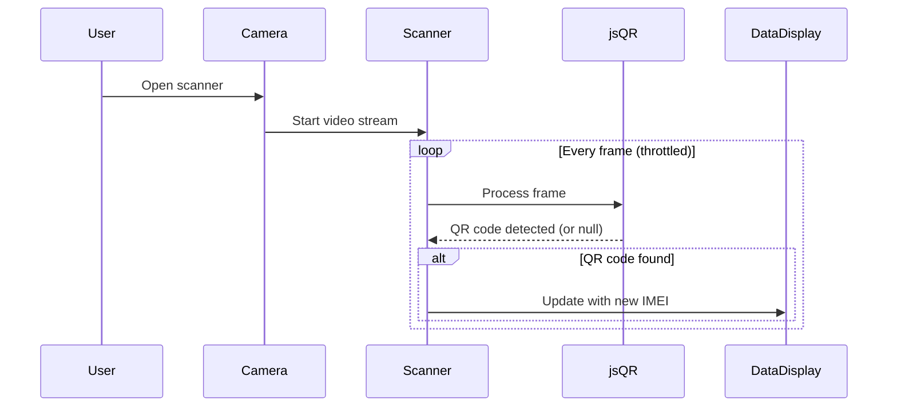
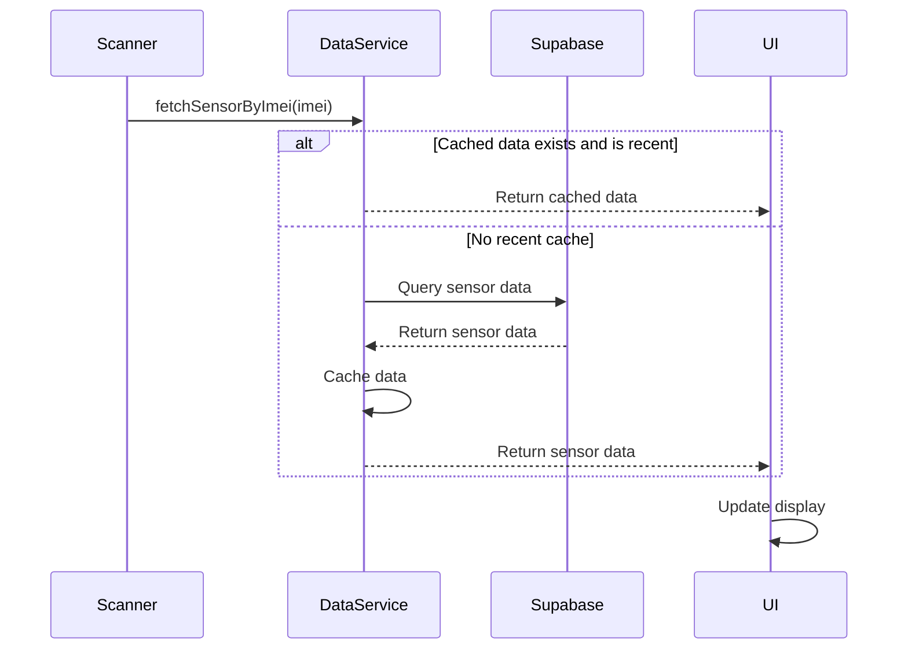

# Sensor Health Check Feature - Implementation Plan

## Overview

We'll create a feature that allows users to scan QR codes on sensor transmitters using their mobile device's camera. The scanning will happen in real-time (without taking pictures), and as the camera moves from one QR code to another, the system will dynamically display the latest data for each sensor.

## Current State Analysis

1. **Existing QR Code Functionality**:
   - The application has QR code scanning capabilities, but it currently takes pictures rather than providing real-time scanning
   - The `scanSensorQrCode()` function in `cameraUtils.ts` handles QR code scanning
   - The `processQRCodeImage()` function in `qrCodeUtils.ts` processes images to extract QR code data
   - The `extractImeiFromQrCode()` function extracts IMEI numbers from QR code data

2. **Sensor Data Structure**:
   - Sensors have properties like name, IMEI, status, and values
   - Sensor values include temperature, humidity, battery level, signal strength, and timestamps
   - Data is stored in Supabase tables (`sensors` and `sensor_values`)

3. **Capacitor Integration**:
   - The app uses Capacitor for mobile capabilities, including camera access
   - The current implementation uses `@capacitor/camera` for taking pictures

## Technical Approach

We'll implement a real-time QR code scanner that continuously processes camera frames to detect QR codes without taking pictures. When a QR code is detected, we'll extract the IMEI, fetch the corresponding sensor data, and display it in a user-friendly interface.

### 1. Real-time QR Code Scanner Component

We'll create a new component that:
- Uses the Web API's `getUserMedia()` to access the camera stream
- Sets up a video element to display the camera feed
- Uses a canvas element to capture frames from the video
- Processes frames with jsQR to detect QR codes in real-time
- Implements debouncing to prevent excessive processing



### 2. Sensor Data Fetching

When a QR code is detected and an IMEI is extracted:
- We'll fetch the latest sensor data using the IMEI
- We'll implement a caching mechanism to avoid redundant API calls
- We'll handle error cases (e.g., invalid QR codes, sensors not found)



### 3. User Interface

We'll create a UI that:
- Shows the camera feed with an overlay for QR code detection
- Displays sensor data (temperature, humidity, signal, battery, last seen) in a clean, readable format
- Provides visual feedback when a QR code is detected
- Includes error states and loading indicators

## Implementation Steps

### Step 1: Create Real-time QR Scanner Component

1. Create a new component `RealtimeQrScanner.tsx` that:
   - Sets up a video element for the camera feed
   - Implements frame capture and processing
   - Detects QR codes and extracts IMEIs
   - Emits events when QR codes are detected

### Step 2: Create Sensor Health Check Page/Component

1. Create a new component `SensorHealthCheck.tsx` that:
   - Integrates the QR scanner component
   - Handles sensor data fetching and display
   - Implements the UI for displaying sensor health data

### Step 3: Enhance Sensor Data Service

1. Add a new function to `supabaseSensorService.ts` to fetch sensor data by IMEI:
   ```typescript
   export const fetchSensorByImei = async (imei: string): Promise<SensorData | null> => {
     // Implementation here
   }
   ```

2. Implement caching to optimize performance

### Step 4: Create QR Code Detection Utility

1. Create a new utility `realtimeQrUtils.ts` for processing video frames and detecting QR codes:
   ```typescript
   export const processVideoFrame = (
     videoElement: HTMLVideoElement, 
     canvasElement: HTMLCanvasElement
   ): string | null => {
     // Implementation here
   }
   ```

### Step 5: Integration and Testing

1. Integrate the new components into the application
2. Test on various devices and with different QR code formats
3. Optimize performance for mobile devices

## Technical Considerations

### Performance Optimization

- We'll implement frame skipping to reduce CPU usage
- We'll use a worker thread for QR code processing if possible
- We'll implement debouncing to prevent excessive API calls

### Mobile Compatibility

- We'll ensure the feature works well on mobile browsers
- We'll use Capacitor's camera API as a fallback if needed
- We'll handle permissions appropriately

### Error Handling

- We'll implement robust error handling for camera access issues
- We'll provide clear feedback when QR codes can't be read
- We'll handle cases where sensor data isn't available

## Dependencies

- **jsQR**: For QR code detection in images/frames
- **@capacitor/camera**: As a fallback for devices that don't support `getUserMedia()`
- **Existing Supabase integration**: For fetching sensor data

## Timeline Estimate

1. Real-time QR Scanner Component: 2-3 days
2. Sensor Health Check UI: 1-2 days
3. Enhanced Sensor Data Service: 1 day
4. QR Code Detection Utility: 1-2 days
5. Integration and Testing: 2-3 days

Total: Approximately 7-11 days

## Risks and Mitigations

| Risk | Mitigation |
|------|------------|
| Poor camera performance on some devices | Implement quality/performance settings and fallback mechanisms |
| QR code detection reliability | Use multiple processing approaches and provide manual input option |
| Battery drain from continuous camera use | Implement power-saving measures (reduced frame rate when inactive) |
| Privacy concerns with camera access | Clear user messaging about camera usage and permissions |